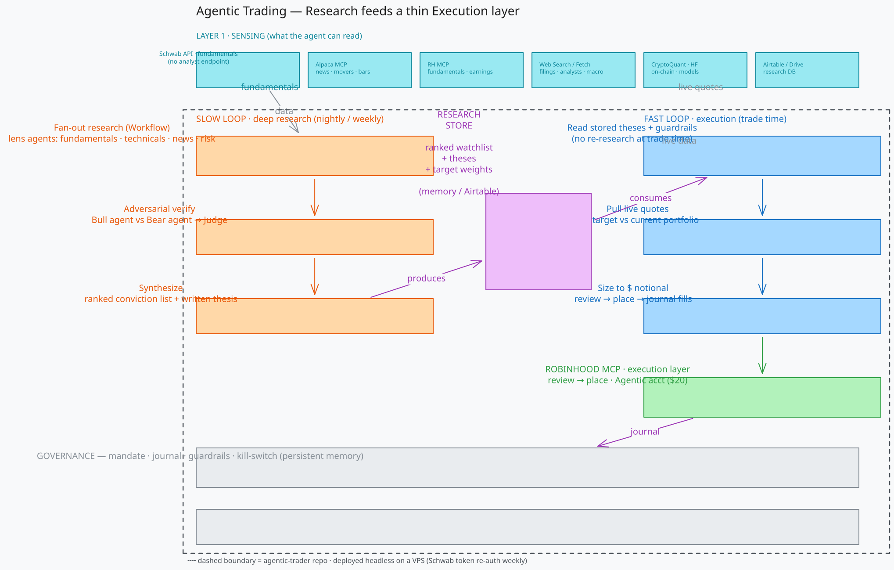

# agentic-trader — Design

A research → execution system for agentic trading. Robinhood is only the thin
execution "hands"; everything valuable is the research stack upstream of it.



> Diagram source: [`architecture.excalidraw`](architecture.excalidraw) (open at
> [excalidraw.com](https://excalidraw.com/)) · last live export baked into the SVG above.

---

## Core idea

Trading is the easy part. The edge is in **informed decisions**, so the system is
layered and the broker is deliberately dumb:

```
LAYER 6  ORCHESTRATION   cadence engine: schedule / loop / event triggers
LAYER 5  GOVERNANCE      mandate + journal + guardrails + kill-switch  (memory)
────────────────────────────────────────────────────────────────────────
LAYER 3  DECISION        portfolio construction: rank -> weight -> size to $
LAYER 2  RESEARCH        turn raw data into a *view*
LAYER 1  SENSING         multi-source data ingestion
────────────────────────────────────────────────────────────────────────
LAYER 4  EXECUTION       Robinhood MCP: review -> place  (thin, dumb, reliable)
```

## Strategy foundation

> ✅ **EDGE = MOMENTUM (settled).** The edge is **hybrid dual momentum**
> (cross-sectional rank + absolute-trend filter), long-only, equities-only
> (options OFF), swing horizon. All design axes are closed: 12-month lookback
> (12-0, no skip); relative rank = equal-weight rank-average of risk-adjusted
> return + trend (close/SMA200); absolute gate = 12mo return > 0; hold top-10
> (banded to 15) + top-4 ETF sleeve; weekly rebalance, nightly risk exits;
> off-switch = cash; **70/30 book/sleeve** capital split. The operational spec —
> written for the deployed agent — is [`docs/STRATEGY.md`](STRATEGY.md); params
> are in `config/strategy.toml`. Earnings-calendar use demotes from *primary
> signal* (the old PEAD first pass) to *defensive event-awareness*. Infra (Schwab
> price history, Research Store, regime gate, config loader) carries over intact.

**Horizon: swing (multi-day to a few weeks).** Chosen for structural fit, not
regulation — our data is EOD-shaped, the slow loop runs nightly, and the edge
below plays out over days-to-weeks. Day trading is off the table on *data cadence
+ loop design*, **not** PDT: the Pattern-Day-Trader rule was eliminated Jun 4 2026,
and in any case it only ever applied to *margin* accounts. Ours is a **cash
account**, so the sole intraday constraint is **T+1 settlement** — a non-issue for
a days-to-weeks hold.

**Edge: hybrid dual momentum.** Horizon ≠ edge — "swing" is how long we hold, not
why we profit. Two independent momentum signals must **agree** to hold a name: it
is strong **relative to its peers** (cross-sectional rank) **and** in its **own
uptrend** (absolute-trend filter). The signal stack, each source with one job:

| Signal | Role | Source |
| ------ | ---- | ------ |
| **Relative-rank momentum** (risk-adj 12mo return + trend) | **primary edge** — winners keep winning over 6–12mo | Schwab price history |
| **Absolute-trend filter** (close/SMA200; 12mo return > 0) | the **off-switch** — long-only rotates to cash when the trend breaks | Schwab price history |
| ETF rotation sleeve (same signal) | parallel engine; defensive assets rank in as the risk-off destination | Schwab price history |
| Fundamental quality | light universe hygiene (the 150 are already liquid large-caps) | Schwab + Finnhub metrics |
| Earnings calendar | **defensive** event-awareness — don't hold a swing into a print | Finnhub + RH |
| News / catalysts | context + risk flag | Alpaca news |

**Instrument: equities-first** (fractional / dollar-notional). Options Level 2
(long-only) exists on RH but is **deferred** — theta bleed fights a multi-week
hold; prove the equity logic first, add options later only if a clear edge
justifies it.

**Validate before trust.** Momentum is the best-evidenced cross-sectional equity
anomaly, but *our* implementation isn't proven until backtested against history
and tracked via outcome feedback (see Research Store). Backtest the signal — full
trade management included — before it touches live money.

## The two-clock model (the key decoupling)

Do **not** run deep research at trade time. Split into two cadences that hand off
through a persisted **Research Store**:

```
  SLOW LOOP (nightly / weekly)              FAST LOOP (at trade time)
  - fan-out research (per lens)             - read stored theses + guardrails
  - adversarial bull/bear verify            - pull live quotes
  - synthesize ranked conviction list  -->  - diff target vs current portfolio
    + theses + target weights               - size to $ notional
        stored in Research Store            - review -> place -> journal fills
```

- **Slow loop** does the expensive thinking and writes a *research product*.
- **Fast loop** is cheap and deterministic; it only acts on that product.

### Research Store design

The handoff is the keystone — it's the basis for *every* trade, so it's designed to
stay coherent as history grows past any single context window.

- **Backend: file-memory** (JSON on the droplet) behind a small typed interface
  (`read_current` / `write_product`), so Airtable stays a drop-in later if a UI is
  wanted. Context window = working memory (RAM); the store = long-term memory
  (disk). You never load all of it — only the current watchlist's theses + recent
  fills + guardrails — so nightly context stays **bounded regardless of total
  history**.
- **Two stores, not one:**
  - **Beliefs** — the *current* view; small, curated, always loaded; one
    self-contained record per name.
  - **Journal** — append-only log of every run + fill; grows forever, *never*
    fully loaded (queried / summarized on demand for audit + backtest).
- **The slow loop revises, it doesn't append.** Each run, per name: does new
  evidence confirm / break / not-touch the existing thesis → **update / retire /
  keep**. The store is a *maintained set of beliefs*, not an accumulation. (This is
  what the bull/bear adversarial step is *for*.)
- **Staleness is mechanically detectable, not remembered.** Every record carries
  `as_of` + evidence `provenance` + a `review_by` trigger (for momentum: "weekly
  rebalance due" / "rank fell below the band"), so rot is *visible* without the model
  recalling it.
- **Outcome tracking closes the loop.** Each thesis points to its `outcome` once
  known → confidence is calibrated against reality, not internal consistency.
  Guards against the confirmation-loop failure (entrenching your own past theses).
- **Model-independent:** plain structured data + prose, so any future agent (or a
  human) can pick it up cold — same "repo = single source of truth" principle.

Thesis record (draft): `symbol, rank, verdict, entry_zone, stop, targets[],
target_weight, confidence, thesis (prose), signals{evidence + provenance}, as_of,
review_by, outcome`.

## Layer 1 — Sensing (data sources)

> **Detailed per-adapter capabilities, verified history depths, and the full
> (mostly unwired) moomoo surface live in [`DATA_SOURCES.md`](DATA_SOURCES.md).**

| Source | Role | Status |
| ------ | ---- | ------ |
| **Schwab API** | PRIMARY: price history/OHLC, fundamentals, options+greeks, movers, quotes (SIP/NBBO) | ✅ connected (Market Data only; 7-day OAuth) |
| **moomoo** (OpenD) | Data-only. WIRED: universe-maint (turnover, market-cap). UNWIRED but available: capital flow, short interest, put/call+IV, insider, earnings-price-move, institutional | ✅ connected. ⚠️ system `python3.10`; OpenD `:11111` shared w/ `moomoo-vol-desk`; history **shallow (~1–2yr)** → forward-log, don't backtest |
| **FRED API** | Macro regime indicators (VIX, `T10Y2Y` curve, `BAMLH0A0HYM2` HY spread). Deep history (decades) | ✅ **built** (`src/adapters/fred/`); confirms the Schwab regime gate |
| **Finnhub API** | Analyst recommendation *trends*, earnings *surprises*, basic financials | ✅ connected (free tier); consumed by `event_calendar` only, **not** the ranking |
| **Alpaca API** | News (symbol-tagged); IEX close+$-vol for the survivorship-free PIT pool (dead names) | ✅ connected (free tier; IEX price only) |
| **Robinhood MCP** | Fundamentals, **earnings calendar/results**, its own screeners; **the execution venue** | available |
| **Web Search / Fetch** | Filings, analyst commentary, macro | available |
| **CryptoQuant / HF** | On-chain, models/papers | available (thematic) |
| **Airtable / Drive** | Structured research DB / store | available |

> **Feed notes.** Alpaca's *price* data is IEX-only on the free plan (single-venue,
> not full NBBO) — so we lean on **Schwab/RH for quotes** and use Alpaca purely for
> **news + screeners**. Finnhub's **price-target** and **forward EPS-estimate**
> endpoints are premium-only; we deliberately skip the price-target *level* (weak,
> biased signal) and treat forward consensus estimates as a deferred maybe.

### Schwab scope (HISTORICAL — adapter removed 2026-07-29; kept as the record of
### what the feed provided and why moomoo could replace it. The scope script is
### deleted; do not try to run it.)

**Available (Market Data API, HTTP 200):**
`quotes`/`quote` (realtime NBBO + field groups: quote, fundamental, extended,
regular, reference), `instruments` (`fundamental`, `symbol-search`, regex/desc
projections), `price_history` (OHLCV, minute→monthly), `option_chains` (call/put
maps **with greeks**, IV, rates), `option_expiration_chain`, `movers`
(`$DJI`/`$SPX`/`NASDAQ`), `market_hours`.

**NOT available:**
- ❌ **Accounts & Trading API** — every account/order/transaction call returns
  `HTTP 401 "Client not authorized"`. The app is **data-only by credential**, so
  it can never trade. (This is desirable — execution lives on Robinhood.)
- ❌ **Analyst ratings / price targets / research reports** — no such endpoint
  exists in the Schwab developer API at all. Fundamentals yes, analysts no.

**Gap — now filled (free):** analyst / news sentiment. Schwab can't provide it, so:
- **News** → **Alpaca** (`src/adapters/alpaca/`, `get_news`, live on the free
  tier — verified: symbol-tagged + market-wide feed both return real-time).
- **Analyst signal** → **Finnhub** free tier (verified live): recommendation
  *trends* + earnings *surprises* + 133 basic-financial metrics. Only the
  price-target *level* and forward EPS consensus are paywalled — the former we
  don't want anyway, the latter is a deferred maybe.

## Layer 4 — Execution (Robinhood)

- Trades only in the dedicated **"Agentic" account** (`agentic_allowed=true`);
  every other Robinhood account is read-only to the agent.
- Funded with **real money**. The balance is deliberately NOT recorded here — a
  figure written into docs goes stale and then gets used to rationalise away risks
  ("it's only a demo account"). Read it live via `src/marks.py` if you need it, and
  never let it size a risk judgement. See `CLAUDE.md` hard rule 3.
- Robinhood enforces: per-trade push notifications, live activity/P&L feed,
  one-tap disconnect. Options are Level 2 there (long only), so equities +
  fractional/dollar-notional orders are the practical surface.

## Layer 5 — Governance

Mandate (universe, rules, weights), journal (every run + fills), guardrails
(max % per name, min/max holdings, halt-on-drawdown, whitelist universe), and a
kill-switch. Persisted so it survives across runs.

## Trade management & risk rules (IBD-SwingTrader-derived)

The *signal* is ours (momentum); the *trade management* is adapted from IBD
SwingTrader, whose entry/exit discipline is edge-agnostic and battle-tested. Each
rule becomes a hard field on the thesis record and/or a governance guardrail:

| Rule | Setting | Where enforced |
| ---- | ------- | -------------- |
| Entry zone | defined buy-price range; never chase **above** it — cheaper never blocks | `entry_zone` + `[trade_management] no_chase`/`chase_tol_sigma`; enforced by `fast_loop.apply_chase_guard` (asymmetric, vol-scaled, fails open). ⚠️ Was documented here as enforced from the start but wired NOWHERE until 2026-07-28 — see OPSLOG |
| Stop loss | defined + enforced, **volatility-adjusted** (below recent swing low / ATR mult) — *not* IBD's flat 2–3% (too tight for volatile momentum names) | `stop`; governance auto-exits on breach |
| Profit targets | tiered at **multiples of risk** (~2.2R / 4R), vol-scaled so reward:risk ≥ 2:1 holds for any name — *not* a fixed 5/10% (unreachable at 2:1 for a high-vol mover) | `targets: [t1, t2]` |
| Moving-average exit | exit if close < short-term MA (e.g. 21-day), even if stop not hit | daily fast-loop check (Schwab price history) |
| Position size | ≤ **10% / name** (IBD "full" = 10%; most trades ½–¾) | `target_weight`, capped in guardrails |
| Reward:risk | ≥ **2:1** = (target−entry)/(entry−stop) | **store validation gate** — reject bad-geometry theses on write |

The reward:risk gate is the key one: the store **structurally cannot** accept a
bad-geometry trade, so quality can't silently rot.

## Regime gate (macro) — mechanical floor + agent overlay

Long-only momentum and IBD-style swing both have **negative expectancy in
down/sideways tape**, so new entries are gated on market regime. The design is
**asymmetric**:

- **Mechanical floor = the ON switch (backtestable, non-negotiable).** No new
  entries unless the broad market passes a mechanical trend test (SPX/QQQ > 50-day
  MA) **and** VIX ≤ `[regime].vix_ceiling` (wired 2026-07-09: live Schwab `$VIX`
  quote, FRED VIXCLS fallback; both down → gate skipped fail-open so a data
  outage can't force cash). Computed from **Schwab** — the load-bearing trend
  gate has **no FRED dependency**. Pure code, provable against history, immune
  to narrative.
- **Agent overlay = the OFF switch only (judgment; veto / downsize).** A tiny
  nightly read may *veto or downsize* on context the numbers can't see ("CPI
  tomorrow → stand down"; "macro-driven tape, stock-specific edge suppressed"). It
  **never green-lights on its own** — blocks the "news sounds great at the top"
  failure (sentiment peaks at tops/bottoms).

**Macro is a deterministic compiler, not agent news-reading** (token discipline +
backtestability):

- **`src/adapters/fred/`** (planned) — supplementary macro (VIX daily, curve, HY
  spread). ⚠️ FRED is **"as-is"** (Fed disclaims uptime; occasional throttling;
  daily-close / T-1 data) → wrap in **retry + cache-last-good** so an outage
  degrades to "trend-gate only", never blocks the run. Free key, `.env` as
  `FRED_API_KEY`; rate limit ~120/min (we use a handful nightly).
- **Earnings event calendar** — ✅ built (`src/event_calendar/`). Finnhub REST
  spine (per-symbol, code-callable) cross-checked against an agent-supplied
  **Robinhood snapshot** (RH's `report.verified` = the confirmed/estimated flag).
  Tags `confirmed` vs `estimated` (never infers confirmed from agreement;
  disagreement → estimated + earliest/conservative date), and **logs date
  revisions** (a pushed-back report skews negative). Never reads the clock (caller
  passes `as_of`/`today`) → reproducible + backtestable. Under momentum it drives
  the **defensive** event-risk veto (`reports_within` — don't hold a swing into a
  print); the offense path (`fresh_reports`, a PEAD relic) is dormant. Verified live.
- **Macro event calendar** (planned, with FRED) — FOMC (static list) + FRED release
  dates (CPI/jobs) for the macro-side event veto. Deterministic, zero tokens.
- **v1 = deterministic-only regime** (mechanical floor + calendar). Defer the agent
  qualitative overlay to v2, once the floor has earned trust.

Store the regime call **+ its rationale** each night → auditable, and
outcome-tracking applies to it ("on risk-off nights, did trades do worse?").

## Layer 6 — Orchestration

Cadence engine: scheduled cloud cron / loop / event triggers (earnings, price
moves). Fires the slow and fast loops on their own clocks.

## Deployment (VPS)

The dashed boundary in the diagram = this repo, deployed **headless on a VPS**
(a DigitalOcean droplet). External data providers sit outside it; the runtime
sits inside.

### In plain English

The droplet is just a small always-on computer in a data center. Today the
"worker" is a human + Claude in a chat; on the droplet the work runs **by itself,
on a timer, with nobody watching**. Three things make that work:

1. **The brain runs on the droplet and bills the right wallet.** Claude Code can
   authenticate two ways: the flat-fee **subscription** (what we want) or a
   **pay-per-token API key** (billed separately, per word). We run on the
   subscription. ⚠️ **The footgun:** if an `ANTHROPIC_API_KEY` is set *anywhere*
   on the box, it silently overrides the subscription and you get billed
   per-token. Rule: ensure `ANTHROPIC_API_KEY` is unset everywhere (crontab,
   `.bashrc`, `.env`, systemd).
2. **Robinhood lets the droplet trade.** RH's Agentic Trading is *designed for*
   unattended automation (their own example: "buy $100 of X every time it drops
   2% in a day"). It's a standard **remote HTTP MCP** (`claude mcp add
   robinhood-trading --transport http https://agent.robinhood.com/mcp/trading`),
   so it works from a headless CLI — not a claude.ai-web-only connector.
3. **A timer (cron) kicks it off** on the slow/fast cadences.

### Auth & billing specifics

- **Claude on the droplet (subscription, not API):** run `claude setup-token` on
  a real machine → produces a ~1-year OAuth token → set
  `CLAUDE_CODE_OAUTH_TOKEN` on the droplet → drive with `claude -p "..."` under
  cron. Keeps usage on the plan. Verify `ANTHROPIC_API_KEY` is absent.
- **Robinhood auth:** desktop needed **once** to open the agentic account +
  complete the OAuth paste flow (verify on the RH mobile app). After that,
  ongoing operation is headless. Token lifetime / re-auth cadence is **not
  documented by RH — treat as unknown and watch for it** (like Schwab's 7 days).
- ~~**Schwab headless auth**~~ and ~~**the 7-day token expiry**~~: both gone with
  the adapter on 2026-07-29. moomoo authenticates through the local OpenD gateway,
  so an unattended deployment now has **no scheduled credential step at all**. The
  auth scripts are deleted — do not reintroduce them.
- **Fair use**: RH explicitly supports automation, and Anthropic is an official
  launch partner for exactly this — so *policy* is not the concern. Plan
  *rate limits* (throughput per window) are real but a pacing problem: space the
  loops out, don't hammer.
- **Liability**: RH disclaims all responsibility for agent decisions/losses —
  "you assume all risk." Assume that liability in full at every balance; do not
  discount it because the book looks small at any given moment.
- **Secrets**: `.env` and `secrets/` are git-ignored; never committed.

## Open decisions

1. ~~**Research Store**~~ — RESOLVED: **file-memory** behind a swappable
   `read_current`/`write_product` interface; Airtable a drop-in later if a UI is
   wanted.
2. ~~**Analyst-data source**~~ — RESOLVED: Finnhub free (recommendation trends +
   earnings surprises) + Alpaca free (news). Paid consensus estimates deferred.
3. ~~**Regime approach**~~ — RESOLVED: mechanical floor (ON, Schwab-computed) +
   agent overlay (OFF-only); **v1 deterministic-only**, agent overlay in v2.
4. ~~**Single edge vs. blend**~~ — RESOLVED (revised): **hybrid dual momentum**
   is the edge (relative rank + absolute trend). PEAD was the first pass and was
   dropped; earnings data demotes to defensive event-awareness. See STRATEGY.md.
5. ~~**Trust before proof**~~ — RESOLVED: **backtest-first** (validate the signal
   vs. history before funding; seeds outcome-tracking).
6. **Verify depth** — single-pass research vs. full bull/bear/judge adversarial
   layer. *(still open)*
7. ~~**Same-day catalyst entries**~~ — RESOLVED: **nightly-only for v1** (momentum
   trends persist for weeks; same-day reaction is a later add).
8. ~~**Universe**~~ — RESOLVED (revised for momentum): **fixed 150 single names**
   (`config/universe.csv`, human-seed reconciled with dollar-volume fill) **+ an
   18-ETF dual-momentum sleeve** (`config/etf_universe.csv`), run as two parallel
   engines at a **70/30** split. Replaces the PEAD earnings-dynamic screen.
9. ~~**ETF role**~~ — RESOLVED: not ballast — a **parallel dual-momentum rotation
   sleeve** (11 SPDR sectors + broad + intl + defensive); defensive assets rank
   in-sleeve as the built-in off-switch destination.

> **Strategy is codified** in [`config/strategy.toml`](../config/strategy.toml) —
> the single source of truth for risk gates, universe, momentum signal params,
> trade management, and the regime floor. The `[risk]` table IS the Research
> Store's validation mandate (`strategy.risk_mandate()`).

## Status

- [x] Repo scaffold + Schwab research adapter
- [x] Schwab connected (Market Data), fundamentals verified live
- [x] Full read-only API scope documented
- [x] Analyst/news source — Finnhub adapter connected (free tier verified live)
- [x] Wrap remaining Schwab endpoints — quote, price history, option chain,
      movers, market hours (all verified live)
- [x] Wire Alpaca news into the sensing layer (repo adapter, verified live)
- [x] Strategy foundation decided — momentum swing (pivoted from a PEAD first pass), equities-first, cash acct
- [x] Trade-management + risk rules speced — IBD-derived, vol-adjusted stops, R:R gate
- [x] Regime-gate design — mechanical floor + agent overlay; FRED vetted as supplement
- [x] Build **earnings event calendar** (`src/event_calendar/`) — Finnhub spine +
      RH snapshot normalizer; confirmed/estimated tagging + revision log; verified live
- [x] Build **Research Store** (`src/research_store/`) — file-memory, belief +
      journal, mandate-validated (≤10%/name, R:R ≥ 2:1); verified live
- [x] Codify the strategy into a **mandate config** (`config/strategy.toml`) —
      risk gates + universe + signal + regime; wired into the store; verified live
- [x] Build FRED macro adapter (`src/adapters/fred/`) — VIX / 10y-2y curve / HY
      spread, retry + cache-last-good; verified live
- [x] **Momentum strategy designed + put to paper** — all axes closed; written
      for the deployed agent in `docs/STRATEGY.md`; params in `config/strategy.toml`
- [x] **Universe built** — fixed 150 (`config/universe.csv`) + 18-ETF sleeve
      (`config/etf_universe.csv`), 70/30 split
- [x] **Backtest the momentum signal** vs history — walk-forward harness built
      (`src/momentum.py` signal SSOT, `scripts/fetch_prices.py`, `scripts/backtest.py`)
      and a sensitivity sweep (`scripts/sweep.py`). First pass (2017–2026, 469 wks,
      70/30): CAGR 34.3% vs SPY 13.1%, Sharpe 1.19 vs 0.78, maxDD −31% ≈ SPY −32%.
      Sweep verdict: **edge is robust** (Sharpe 0.97–1.33 across 16 configs, all beat
      SPY). ⚠️ **survivorship-biased upper bound** (today's 150 names run over history)
      + no intra-week stops modeled — NOT a forecast yet.
- [x] **Point-in-time universe rebuild** — survivorship bias killed. Pool of 816
      (`scripts/build_pool.py` → `config/pit_pool.csv`: S&P-500 PIT members + our
      150 + ETFs + hand-listed dead names) pulled from Alpaca IEX
      (`scripts/fetch_pool.py`, the only free feed serving delisted names); PIT
      backtest (`scripts/backtest_pit.py`) ranks top-150 by trailing $-vol per date.
      **Honest result (matched window/data 2021-08..2026-07): CAGR 23.2% / Sharpe
      0.97 vs SPY 12.4% / 0.80** — the edge survives. Biased fixed-150 over the same
      window was 37.7%/1.25, so survivorship inflated CAGR ~14.5pts/yr. Risk
      framework validated: held-into-death=0 (collapsing names ejected by the
      absolute gate + trend filter before delisting). Caveats: 5yr window (Alpaca
      free floor), noisy IEX-slice volume for ranking, no intra-week stops modeled.
- [ ] Macro event calendar (FOMC/CPI dates) — deterministic event-risk feed
- [x] **Slow loop** (`scripts/slow_loop.py`) — deterministic: momentum signal →
      top-10 book + top-4 sleeve → IBD geometry (vol-scaled, R:R≥2) → validated
      write to the Research Store. Writes a full 14-name book, verified round-trip.
- [x] **Fast loop** (`scripts/fast_loop.py`) — deterministic diff (targets vs.
      holdings → dollar-notional buy/sell plan, tested); enforces the one-Agentic-
      account guardrail. Verified live read-only against RH (a one-off 2026-07
      bring-up check: whatever cash was present → a full 14-order plan; the
      figures were a point-in-time observation, not a standing account size).
      **Placement (review→place) held at the proof gate** — needs
      explicit human approval before any live order.
- [ ] Wire the RH read (get_equity_positions/get_portfolio → snapshot) + the
      review→place placement step into the deployed agent's fast-loop run
- [x] **Governance guardrails** (`src/governance.py`) — kill-switch file,
      drawdown halt (peak-tracked), per-order cap, universe whitelist, and the
      `[proof] live_approved` master switch. Wired into the fast loop; the
      mechanical regime floor lives in `momentum.regime_on` + the slow loop.
- [x] **Orchestration + deploy artifacts** — `deploy/` (run_slow_loop.sh,
      run_fast_loop.sh with the ANTHROPIC_API_KEY footgun guard, crontab.template),
      `prompts/fast_loop.md` (the headless-Claude execution procedure), and
      `docs/DEPLOY.md` (the ordered droplet runbook).
- [x] **Intraday exit monitor** (`scripts/market_monitor.py`) — the always-on
      stop-loss / take-profit watcher the daily loops couldn't be. Polls live
      Schwab quotes for held names every ~15s during RTH, checks vs. each name's
      stored stop/targets, and fires the headless executor (`prompts/exit.md`) to
      market-sell on a breach (fractional sells are allowed; native stops are NOT
      — RH blocks stops on sub-1-share positions). Stopped-out names get a cooldown
      the slow loop honors (no rebuy churn). Runs as a systemd service
      (`deploy/agentic-monitor.service`); alert-only when `live_approved`/
      `alert_only` say so. Governed by the kill-switch.
- [x] **Live on the droplet** — full book placed with real money; deposit sizing
      validated; deterministic fill journaling.
- [x] **Monitoring dashboard** — `dashboard/app.py` (Flask, 127.0.0.1:8787,
      password-gated fail-closed) live at `dash.ethobs.uk` via a Cloudflare Tunnel
      (`cloudflared` systemd); `scripts/log_equity.py` records the equity curve.
      See docs/DEPLOY.md "Dashboard" + "Operations & troubleshooting".
- [ ] Remaining (optional): nightly *exits-only* loop mode, alerting on loop
      failure, fill reconciliation, monitor heartbeat, intraday equity marks.
